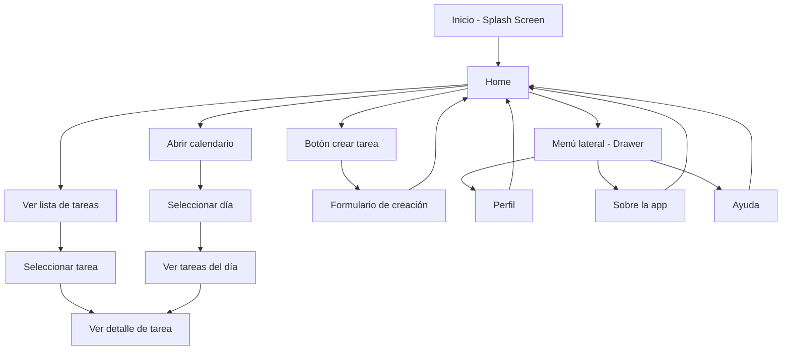

# MyHomework: Sistema de gestión y recordatorios académicos

## Descripción
MyHomework es una aplicación móvil diseñada para ayudar a estudiantes a organizar sus tareas académicas de manera eficiente.

La aplicación permite registrar actividades con fechas límite, descripciones y niveles de prioridad, además de generar recordatorios automáticos para evitar olvidos y mejorar la planificación del tiempo.

---

## Funcionalidades implementadas

- Visualización de tareas en pantalla principal
- Navegación a detalle de cada tarea
- Creación de nuevas tareas (formulario)
- Visualización de tareas por fecha mediante calendario
- Navegación mediante menú lateral (Drawer)
- Pantalla de inicio (Splash Screen)
- Pantallas adicionales: Perfil, Ayuda y Sobre la aplicación

---

## Instrucciones de uso
1. Al iniciar la aplicación, se muestra una pantalla de inicio (Splash Screen).
2. Luego se accede a la pantalla principal con la lista de tareas.
3. Cada tarea se presenta en formato de tarjeta con título, asignatura y fecha.
4. Al presionar una tarea, se accede a la pantalla de detalle.
5. El botón "+" permite acceder a la pantalla de creación de nuevas tareas.
6. El menú lateral (Drawer) permite navegar entre las distintas secciones.
7. Actualmente, las funcionalidades utilizan datos simulados y no se almacenan de forma persistente.

---

## Estado actual del proyecto

El proyecto corresponde a una maqueta funcional, que implementa el flujo principal de la aplicación:

- Splash Screen inicial
- Listado de tareas
- Visualización de tareas en calendario
- Creación de tareas
- Pantalla de detalle
- Pantallas adicionales (Perfil, Ayuda, Sobre la app)
- Navegación completa mediante Drawer
- Uso de Theme global para consistencia visual

---

## Arquitectura del proyecto

El proyecto sigue una estructura modular basada en Flutter:

- **screens/**: contiene todas las pantallas de la aplicación
- **widgets/**: componentes reutilizables (tarjetas, drawer, etc.)
- **main.dart**: punto de entrada de la aplicación
- **app_routes.dart**: configuración de rutas y navegación

Se utiliza navegación basada en rutas mediante (`Navigator`), permitiendo la transición entre pantallas y el flujo de la aplicación.

---

## Datos de ejemplo
La aplicación utiliza datos simulados para representar tareas, incluyendo:
- Título de la tarea
- Asignatura
- Fecha de entrega
Estos datos permiten demostrar el funcionamiento de la interfaz sin requerir persistencia.

---

## Características del dispositivo móvil
La aplicación aprovecha funcionalidades propias de dispositivos móviles como:

- Interfaz táctil intuitiva
- Acceso rápido desde cualquier lugar
- Organización visual de datos
- Simulación de recordatorios

---

## Requerimientos

### Historias de usuario

- Como estudiante, quiero agregar tareas para organizar mis actividades.
- Como estudiante, quiero asignar fechas límite para no olvidar entregas.
- Como estudiante, quiero recibir recordatorios antes de una tarea.
- Como estudiante, quiero visualizar todas mis tareas en una lista.

---

### Requerimientos funcionales

- El sistema permite crear tareas
- El sistema permite visualizar tareas
- El sistema permite ver el detalle de una tarea
- El sistema permite visualizar tareas en un calendario
- El sistema permite navegar entre distintas pantallas mediante un menú lateral

---

### Requerimientos no funcionales

- La aplicación debe ser rápida y responsiva
- Debe ser fácil de usar
- Debe funcionar en dispositivos Android
- Debe tener bajo consumo de recursos

---

## Limitaciones actuales

- No existe persistencia de datos (las tareas no se guardan)
- No se implementan notificaciones reales
- No se pueden editar ni eliminar tareas
- Los datos utilizados son simulados

---

## Tecnologías utilizadas

- Flutter (framework de desarrollo multiplataforma)
- Dart (lenguaje de programación)
- Material Design (sistema de diseño)
- Navigator (gestión de rutas)
- TableCalendar (visualización de calendario)

---

## Diagrama de flujo

## Investigacion
[RESEARCH.md](RESEARCH.md)
