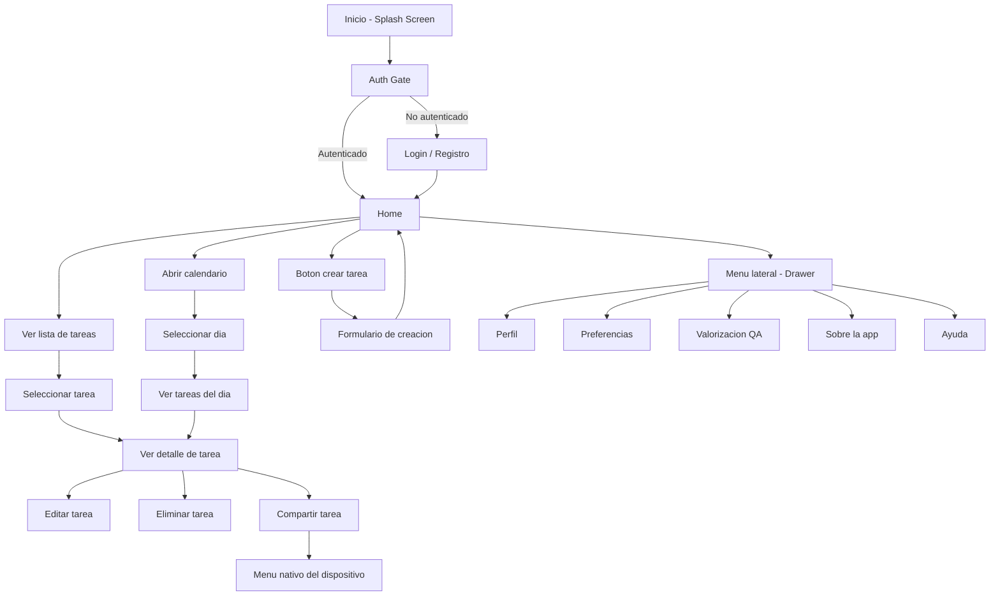
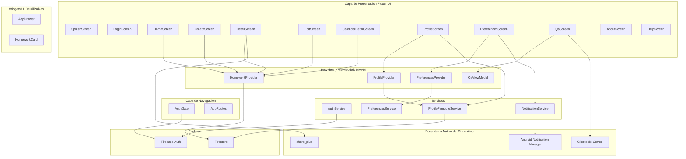
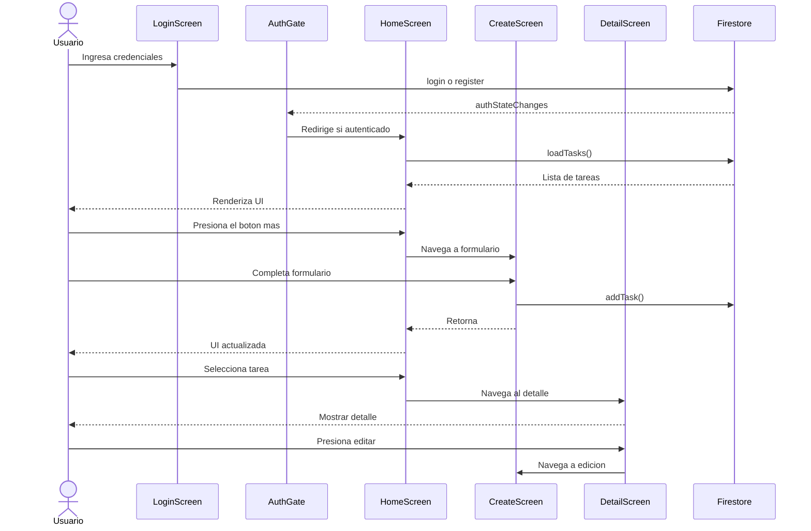
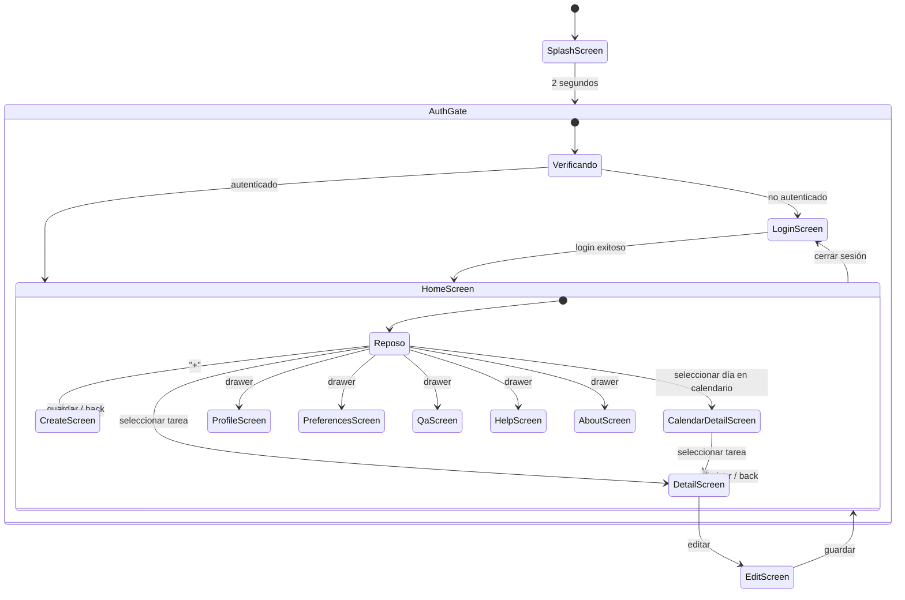

# MyHomework: Sistema de gestión y recordatorios académicos

## Descripción

MyHomework es una aplicación móvil desarrollada en Flutter para ayudar a estudiantes a organizar sus tareas académicas de manera eficiente.

La aplicación permite registrar tareas con fechas límite y descripciones, visualizarlas en un calendario, recibir notificaciones de recordatorio, y gestionar un perfil de usuario con autenticación mediante Firebase.

---

## Funcionalidades implementadas

- Autenticación de usuarios (registro e inicio de sesión con Firebase Auth)
- Visualización de tareas en pantalla principal
- Creación de nuevas tareas (título, asignatura, fecha de entrega, descripción)
- Edición y eliminación de tareas
- Eliminación rápida con deslizamiento (Dismissible)
- Visualización de tareas por fecha mediante calendario interactivo
- Notificaciones locales y recordatorio diario
- Perfil de usuario editable (nombre, sincronizado con Firestore)
- Preferencias de usuario persistentes (notificaciones, modo compacto, recordatorio diario)
- Compartir tareas con otras apps del dispositivo (WhatsApp, correo, etc.)
- Sistema de valorización QA con envío de respuestas por correo
- Navegación mediante menú lateral (Drawer)
- Pantalla de inicio (Splash Screen)
- Pantallas adicionales: Perfil, Ayuda, Sobre la aplicación

---

## Instrucciones de uso

1. Al iniciar la aplicación, se muestra una pantalla de inicio (Splash Screen).
2. Se redirige automáticamente a la pantalla de autenticación.
3. El usuario puede iniciar sesión o crear una cuenta con correo y contraseña.
4. Una vez autenticado, se accede a la pantalla principal con la lista de tareas y el calendario.
5. Cada tarea se presenta en formato de tarjeta con título, asignatura y fecha.
6. Al presionar una tarea, se accede al detalle, donde se puede editar o eliminar.
7. También se puede eliminar una tarea deslizando la tarjeta hacia la izquierda.
8. El botón "+" permite crear nuevas tareas.
9. El menú lateral (Drawer) permite navegar entre las distintas secciones.
10. Desde Preferencias se pueden configurar notificaciones y el modo compacto.

---

## Estado actual del proyecto

El proyecto es una aplicación funcional con backend real, que implementa el flujo completo de la aplicación:

- Autenticación con Firebase Auth
- Persistencia de tareas con Firebase Firestore
- Notificaciones locales con flutter_local_notifications
- Preferencias persistentes con SharedPreferences
- Perfil de usuario sincronizado con Firestore
- Gestión de estado con Provider y patrón MVVM
- Navegación completa mediante Drawer
- Tema global consistente

---

## Arquitectura del proyecto

El proyecto sigue el patrón **MVVM (Model-View-ViewModel)** con una estructura modular por capas:

- **screens/**: pantallas de la aplicación (Views)
- **widgets/**: componentes reutilizables (tarjetas, drawer, etc.)
- **providers/**: gestión de estado (ViewModels)
- **viewmodels/**: lógica de presentación (QaViewModel)
- **models/**: modelos de datos (Homework, Profile, etc.)
- **services/**: servicios desacoplados (Auth, Firestore, Notificaciones, Preferencias)
- **routes/**: configuración de rutas y navegación
- **main.dart**: punto de entrada de la aplicación
- **app.dart**: configuración del tema y rutas

---

## Estructura del proyecto

```text
lib/
├── models/
├── providers/
├── routes/
├── screens/
├── services/
├── viewmodels/
├── widgets/
├── app.dart
├── auth_gate.dart
├── firebase_options.dart
└── main.dart
```

---

## Tecnologías utilizadas

| Tecnología | Uso |
|---|---|
| Flutter | Framework de desarrollo multiplataforma |
| Dart | Lenguaje de programación |
| Firebase Auth | Autenticación de usuarios |
| Firebase Firestore | Persistencia de datos en la nube |
| Provider | Gestión de estado |
| flutter_local_notifications | Notificaciones locales |
| SharedPreferences | Persistencia de preferencias del usuario |
| TableCalendar | Visualización de calendario interactivo |
| share_plus | Compartir contenido con el ecosistema nativo del dispositivo |
| url_launcher | Envío de correos desde la app |
| Material Design | Sistema de diseño visual |

---

## Requerimientos

### Historias de usuario

- Como estudiante, quiero registrarme e iniciar sesión para tener mis tareas sincronizadas.
- Como estudiante, quiero agregar tareas para organizar mis actividades.
- Como estudiante, quiero asignar fechas límite para no olvidar entregas.
- Como estudiante, quiero recibir notificaciones de recordatorio antes de una tarea.
- Como estudiante, quiero visualizar todas mis tareas en una lista y en un calendario.
- Como estudiante, quiero editar o eliminar tareas para mantener mi lista actualizada.
- Como estudiante, quiero configurar mis preferencias de notificación.

---

### Requerimientos funcionales

- El sistema permite registrar e iniciar sesión con correo y contraseña
- El sistema permite crear tareas con título, asignatura, fecha y descripción
- El sistema permite visualizar, editar y eliminar tareas
- El sistema permite ver tareas en un calendario interactivo
- El sistema envía notificaciones locales de recordatorio
- El sistema persiste preferencias del usuario entre sesiones
- El sistema permite navegar entre pantallas mediante un menú lateral

---

### Requerimientos no funcionales

- La aplicación debe ser rápida y responsiva
- Debe ser fácil de usar para estudiantes
- Debe funcionar en dispositivos Android
- Debe mantener los datos sincronizados con Firebase
- Debe tener bajo consumo de recursos

---

## Características del dispositivo móvil

La aplicación aprovecha funcionalidades propias de dispositivos móviles:

- Interfaz táctil intuitiva (gestos de deslizamiento para eliminar)
- Notificaciones locales del sistema operativo
- Acceso a cliente de correo del dispositivo (envío de valorización)
- Almacenamiento persistente local (SharedPreferences)
- Conectividad con servicios en la nube (Firebase)

---

## Diagrama de flujo



---

# Arquitectura y Modelado

Como parte del proceso de validación técnica y diseño de la solución móvil, se desarrollaron distintos artefactos de ingeniería de software orientados a modelar:

- Separación de responsabilidades (MVVM)
- Flujo asíncrono de la aplicación
- Gestión de estados críticos
- Integración entre Flutter y servicios nativos Android y Firebase

---

# Artefactos de Ingeniería de Software

---

## Diagrama Estructural



---

## Diagrama de Secuencia



---

## Diagrama de estados



---

## Matriz de Dependencias Técnicas

| Dominio de necesidad | Tecnología seleccionada | Justificación técnica |
|---|---|---|
| Autenticación de usuarios | Firebase Auth | Solución robusta y segura para autenticación con correo/contraseña, con gestión de sesión automática mediante streams. |
| Persistencia de datos en la nube | Firebase Firestore | Base de datos NoSQL en tiempo real, integrada con Firebase Auth para seguridad por usuario. |
| Notificaciones locales | flutter_local_notifications | Plugin maduro con soporte activo para Android/iOS, permite notificaciones programadas sin backend. |
| Gestión de estado | Provider | Solución oficial recomendada por Flutter, liviana y adecuada para el tamaño del proyecto. |
| Persistencia de preferencias | SharedPreferences | Almacenamiento clave-valor simple y eficiente para configuraciones locales del usuario. |
| Interfaz de usuario | Flutter (Material Design) | Framework oficial de Google con motor de renderizado propio, garantiza consistencia UI/UX multiplataforma. |
| Arquitectura | MVVM con Provider | Separación clara entre UI, lógica de negocio y datos, facilitando mantenimiento y escalabilidad. |
| Envío de valorización | url_launcher | Permite abrir el cliente de correo nativo del dispositivo con contenido prellenado. |

---
 ## Reporte de QA / Beta Testing

### Resumen ejecutivo

Se realizó una validación funcional con **12 usuarios reales**, quienes evaluaron la aplicación mediante un instrumento estructurado en JSON con 11 preguntas distribuidas en 3 categorías: Usabilidad, Contenido y Compartir. Las respuestas fueron enviadas por correo electrónico directamente desde la aplicación.

### Resultados por categoría

| Categoría | Promedio |
|---|---|
| Usabilidad | 4.65 / 5 |
| Contenido | 4.67 / 5 |
| Compartir y recomendación | 4.58 / 5 |
| **Promedio general** | **4.63 / 5** |

### Resultados por pregunta

| Pregunta | Promedio |
|---|---|
| Facilidad de navegación | 4.58 / 5 |
| Completar tareas sin problemas | 4.67 / 5 |
| Interfaz gráfica y claridad | 4.67 / 5 |
| Personalización de preferencias | 4.67 / 5 |
| Utilidad del contenido | 4.58 / 5 |
| Adaptación a expectativas | 4.67 / 5 |
| Claridad del contenido | 4.75 / 5 |
| Probabilidad de recomendar la app | 4.33 / 5 |
| Comodidad al compartir la app | 4.75 / 5 |
| Utilidad para personas cercanas | 4.75 / 5 |
| Satisfacción general | 4.50 / 5 |

### Qué funcionó bien

- La **claridad del contenido** y la **comodidad al compartir** obtuvieron las puntuaciones más altas (4.75/5), lo que indica que la información está bien presentada y la funcionalidad de compartir tareas fue bien recibida.
- La **usabilidad general** fue muy bien evaluada, con promedios sobre 4.6 en todas sus preguntas, lo que refleja que la navegación y el flujo de la app son intuitivos.
- La **utilidad del contenido** y su adaptación a las expectativas del usuario resultaron consistentemente altas, validando que la propuesta de valor de la app es relevante para estudiantes.

### Qué tuvo menor puntuación

- La pregunta con menor promedio fue **"Probabilidad de recomendar la app a un amigo" (4.33/5)**, lo que sugiere que, si bien la experiencia es positiva, algunos usuarios dudan en recomendarla activamente, posiblemente por considerarla aún en desarrollo o por la falta de funcionalidades avanzadas.

### Trabajos futuros (Deuda Técnica)

- **Búsqueda y filtrado de tareas**: poder buscar tareas por nombre o filtrarlas por asignatura o estado.
- **Cambio de imagen de perfil**: la funcionalidad está marcada como pendiente en la pantalla de perfil.
- **Prioridad de tareas**: agregar niveles de prioridad (alta, media, baja) para una mejor organización.
- **Modo oscuro**: mejorar la experiencia visual en condiciones de poca luz.
- **Notificaciones más granulares**: permitir configurar con cuántos días de anticipación se desea recibir el recordatorio de una tarea.

---

## Investigación

[RESEARCH.md](RESEARCH.md)

---

## Proof of Concept (PoC)

La validación técnica de notificaciones locales fue desarrollada en la rama:

`feature/poc_notificaciones_locales`

Documentación completa disponible en:

[POC.md](POC.md)

---

## Autor

Desarrollado por David Valdés Hernández (DavidMarvel)  
Proyecto académico — Programación de Dispositivos Móviles